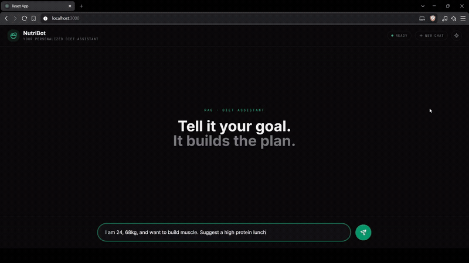

# NutriBot – RAG Diet Assistant

A retrieval-augmented chatbot that suggests personalized diet plans from a curated nutrition dataset. It retrieves relevant food descriptions from ChromaDB, reranks them, and asks an LLM to generate context-aware, portioned recommendations with explanations.



## Features

- **Personalized answers**: Prompt enforces age/weight/goal awareness, portions, and “why” reasoning.
- **Allergy & medical safety**: Refuses to recommend a food that conflicts with a stated allergy or condition, even if it's in the retrieved context - verified by the eval suite's safety metrics, not just prompted and hoped for.
- **Multilingual**: Auto-detects the language you type in and replies in the same language - no manual language picker.
- **RAG stack**: ChromaDB with `all-mpnet-base-v2` embeddings; cross-encoder reranker `ms-marco-MiniLM-L-6-v2`.
- **LLM**: `gpt-oss:120b` via [Ollama Cloud](https://ollama.com/cloud) (free tier) for generation. The eval suite's LLM-judge uses Gemini `gemini-3.1-flash-lite` separately, deliberately on a different provider than generation to avoid self-grading bias.
- **Frontend UX**: A welcome screen with starter prompts, a light/dark theme that follows your system setting and is remembered, keyboard and screen-reader support, hover citations, speech synthesis read-aloud, a shimmer skeleton loading state, and “New Chat” that fully resets history.
- **Sources**: Hovering a cited food name in an answer shows the real retrieved snippet behind it.

## Project Structure

```
NutriBot-RAG/
├── backend/
│   ├── ingest.py            # Ingest nutrition_data.txt into ChromaDB
│   ├── server.py            # Flask API (thin wrapper over rag.py)
│   ├── rag.py               # Retrieve / rerank / prompt / generate pipeline
│   ├── config.py            # Settings, API keys, CORS origins
│   ├── requirements*.txt    # Backend dependencies
│   ├── data/
│   │   └── nutrition_data.txt
│   ├── eval/                # Evaluation suite
│   ├── tests/               # Backend tests
│   └── chroma_db/           # Generated vector store (created after ingest)
└── react-frontend/
    ├── package.json
    ├── tailwind.config.js
    ├── scripts/
    │   └── check-contrast.js    # WCAG AA check for the design tokens
    └── src/
        ├── App.js
        ├── index.css
        ├── components/
        │   ├── ChatInterface.jsx
        │   ├── Header.jsx
        │   ├── Composer.jsx
        │   ├── WelcomeScreen.jsx
        │   ├── MessageList.jsx
        │   ├── Message.jsx
        │   ├── AssistantAnswer.jsx
        │   └── CitationTooltip.jsx
        ├── hooks/
        │   ├── useTheme.js
        │   └── useSpeech.js
        └── utils/
            └── translator.js
```

## Backend Setup

```bash
cd backend
pip install -r requirements.txt

# Set your API keys
cp .env.example .env
# then edit backend/.env:
#   OLLAMA_API_KEY=your_key_here   (required - generation; get one at https://ollama.com/settings/keys)
#   GEMINI_API_KEY=your_key_here   (only needed to run the eval suite's LLM-judge)

# Build / refresh the vector store
python ingest.py

# Run the API
python server.py  # listens on http://127.0.0.1:5000
```

For a non-debug run, use `waitress-serve --host=127.0.0.1 --port=5000 server:app` instead of
`python server.py`.

## Frontend Setup

```bash
cd react-frontend
npm install
npm start  # opens http://localhost:3000
```

`npm run check:contrast` verifies the design tokens meet WCAG AA. The backend allows the origins
`http://localhost:3000` and `http://127.0.0.1:3000` by default (override with `ALLOWED_ORIGINS` in `backend/.env`).

## Usage

1) Start backend (`python server.py`).  
2) Start frontend (`npm start`).  
3) Ask for meal guidance (e.g., “I am 21, 75kg. Suggest a high-protein lunch”).  
4) Click **New Chat** to fully reset conversation (frontend and backend history).  
5) Use the **Read aloud** button on answers to hear text-to-speech.

## Regenerating the DB

If you change `data/nutrition_data.txt`, delete `backend/chroma_db/` (or let ingest overwrite) and rerun:

```bash
cd backend
python ingest.py
```

## Notes

- API keys are read from `backend/.env` (via `python-dotenv`) or the environment - see
  `backend/config.py`. Never hardcoded in source, never commit `.env`.
- The typing indicator is a shimmer skeleton during response generation; the assistant replies after retrieval + rerank + the Ollama Cloud generation call.
- `backend/rag.py` holds the whole retrieve/rerank/prompt/generate pipeline as importable functions;
  `server.py` is a thin Flask wrapper over it, and `backend/eval` imports the same functions so
  evaluation numbers describe production rather than a separate reimplementation.
- Backend evaluation lives in `backend/eval/` (see below) - run with
  `python -m eval.run --config all --runs 3` from inside `backend/`.
